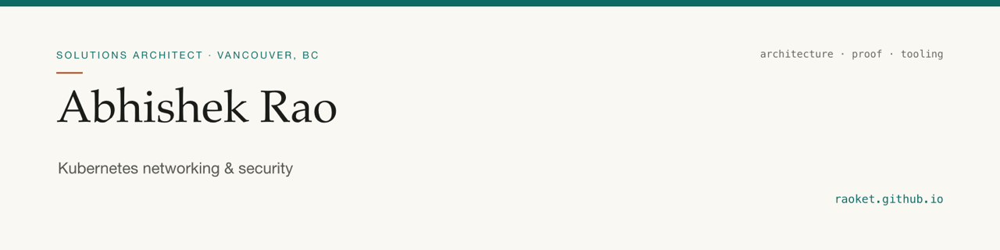

<p align="center">
  
</p>

<h3 align="center">
  <a href="https://raoket.github.io">Visit the site &rarr;</a>
</h3>

<p align="center">
  Selected work, published writing, and how I work.<br>
  <a href="https://raoket.github.io/#work">Work</a> ·
  <a href="https://raoket.github.io/#writing">Writing</a> ·
  <a href="https://raoket.github.io/#experience">Experience</a> ·
  <a href="https://raoket.github.io/Abhishek-Rao-Resume.pdf">Résumé</a>
</p>

<p align="center">
  <a href="https://www.linkedin.com/in/iabhishekrao/">LinkedIn</a> ·
  <a href="https://medium.com/@rao-simplifies">Medium</a> ·
  <a href="https://www.tigera.io/blog/author/abhishek-rao/">Tigera author page</a>
</p>

---

<details>
<summary>About this repository</summary>

<br>

The source for the site above. One self-contained `index.html`: inline CSS and JS, no
framework, no build step, no dependencies. Light and dark themes with a manual toggle
persisted in `localStorage`, an inline-SVG paper grain, and a scroll reveal that disables
itself under `prefers-reduced-motion`. Served by GitHub Pages from `main`.

| File | Purpose |
|---|---|
| `index.html` | The entire site |
| `og.png` | Link-preview card, rendered with typst |
| `banner.png` | Header image, same pipeline and palette |
| `portrait.jpg` | Hero portrait |
| `Abhishek-Rao-Resume.pdf` | Résumé, linked from the hero and footer |
| `robots.txt` | Keeps the résumé out of search indexes |
| `.nojekyll` | Skip Jekyll processing |

Local preview:

```sh
python3 -m http.server 8000
```

To use a custom domain later, add a `CNAME` file containing the bare domain and point DNS
at GitHub Pages. Nothing else changes.

</details>
